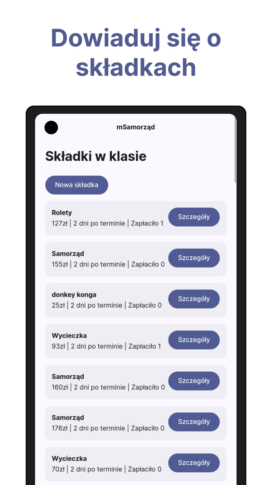
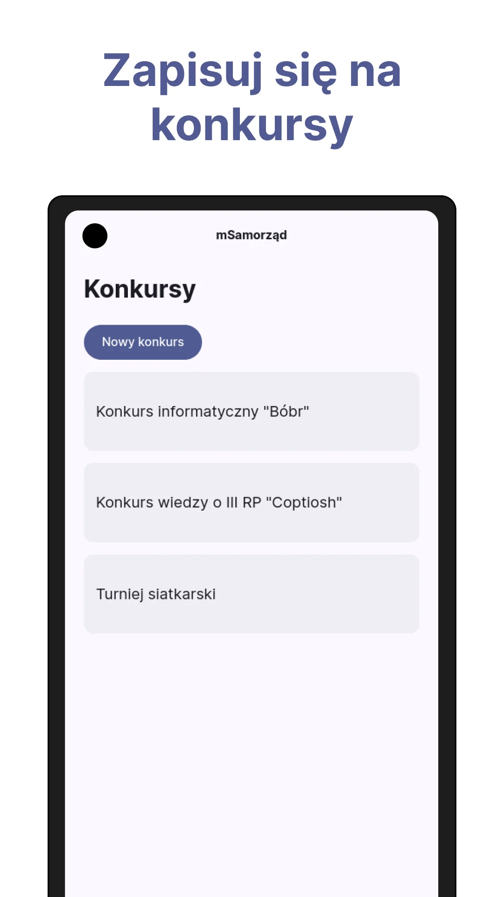
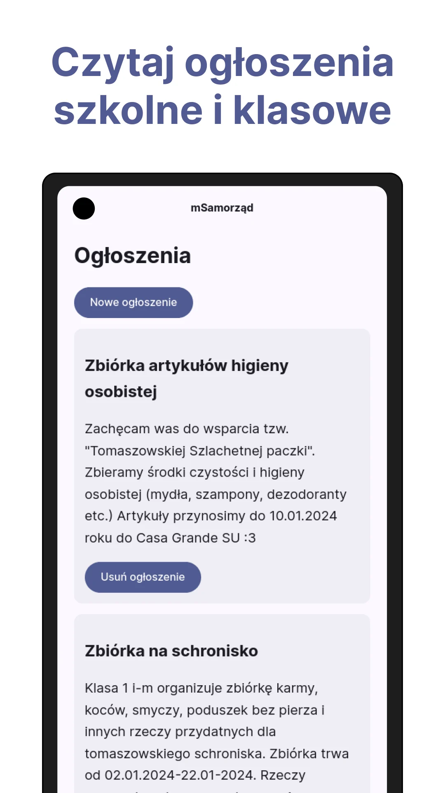

# mSamorząd

Aplikacja mSamorząd pomaga zarządzać samorządem uczniowskim, a uczniom dowiadywać się o konkursach czy składkach
obowiązujących w ich klasie i szkole.






## Uruchamianie

Aplikacja (a tak właściwie PWA) została wykonana za pomocą następujących technologii:

- PHP 8.1
- Laravel 10 (trzeba zrobić kiedyś upgrade do 11)
- MySQL
- Laravel Pulse
- Laravel Octane
- Swoole
- Hotwire Turbo
- nginx

Do uruchomienia aplikacji zalecamy wykorzystanie systemu operacyjnego Linux bądź *BSD. My na instancji wdrożonej w II LO
w Tomaszowie wykorzystujemy Ubuntu Server 22.04. Nie jesteśmy w stanie zapewnić wsparcia dla hostów na Windowsie.

Strona internetowa działa na najnowszych wersjach wszystkich przeglądarek: Chrome, Firefox oraz Safari.

1. zainstaluj dependency za pomocą Composer'a: ```composer install```
2. uzupełnij plik .env credentialami do bazy danych
3. Uruchom ```php artisan migrate --seed```
4. Wygeneruj klucz aplikacji: ```php artisan key:generate```
5. Uruchom serwer deweloperski za pomocą ```php artisan serve```
6. Zaloguj się na konto test.admin za pomocą hasła `password`. Usuń resztę zseedowanych użytkowników, postów, składek,
   etc z bazy danych.
7. Zaadaptuj następujący config nginx'a pod swoją domenę:

```nginx
server {
        server_name msamorzad.pl;
        server_tokens off;
        root /var/www/msamorzad.pl/public;

        index index.php;

        charset utf-8;

        location /index.php {
                try_files /not_exists @octane;
        }

        location / {
                try_files $uri $uri/ @octane;
        }

        location = /favicon.ico { access_log off; log_not_found off; }
        location = /robots.txt  { access_log off; log_not_found off; }

        access_log off;
        error_log /var/log/nginx/msamorzad.pl-error.log error;

        error_page 404 /index.php;

        location @octane {
                set $suffix "";

                if ($uri = /index.php) {
                        set $suffix ?$query_string;
                }

                proxy_http_version 1.1;
                proxy_set_header Host $http_host;
                proxy_set_header Scheme $scheme;
                proxy_set_header SERVER_PORT $server_port;
                proxy_set_header REMOTE_ADDR $remote_addr;
                proxy_set_header X-Forwarded-For $proxy_add_x_forwarded_for;
                proxy_set_header Upgrade $http_upgrade;
                proxy_set_header Connection $connection_upgrade;

                proxy_pass http://127.0.0.1:8000$suffix;
        }
}
```

8. Opcjonalnie, skonfiguruj CRON job'a od wysyłania powiadomień - komenda od wysyłania powiadomień to ```payment:due```

Jeżeli udało ci się wykonać poprzednie kroki - gratulacje, udało ci się postawić mSamorząd na swoim serwerze!
[Uruchamiasz mSamorząd w szkole? Zapraszamy do podzielenia się z nami tą informacją!](https://t.me/dzienniczektrolliusz)

### Licencja

Aplikacja mSamorząd jest udostępniona na licencji [GNU AGPL 3.0](LICENCE)
